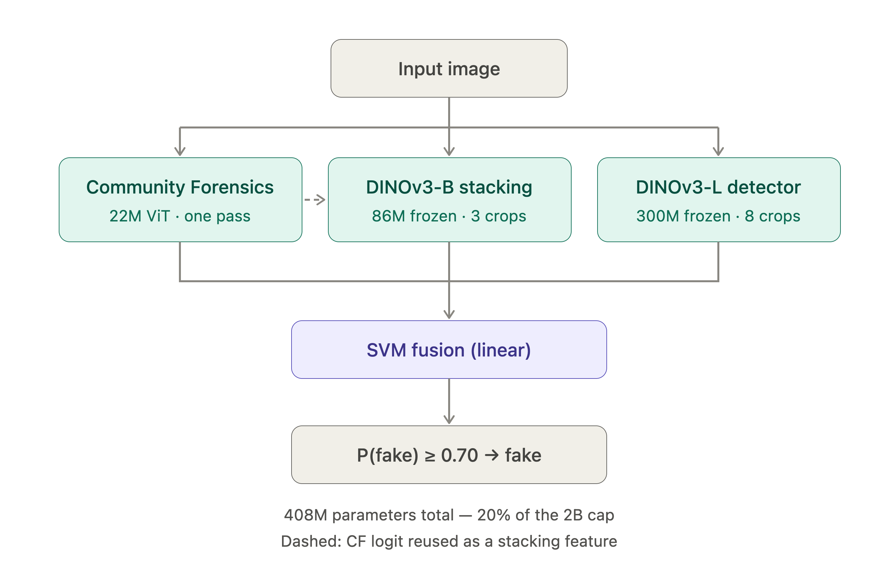

# AI-Generated Image Detection

A production-grade, highly robust machine learning pipeline for classifying
images as **Real (`0`)** or **AIGC-Generated (`1`)**.

The system leverages a tri-branch architecture combining off-the-shelf forensic
representations, fine-tuned large Vision Transformers with multi-crop Test-Time
Augmentation (TTA), and frozen multi-scale feature stacking, fused via a
cross-validated Linear SVM model.

---

## Architecture Overview



### Tri-Branch Design

1. **Branch 1 (Community Forensics ViT-S/16)**: An independent off-the-shelf
   forensic baseline extracting uncalibrated artifact signals.
2. **Branch 2 (DINOv3-Large Detector)**: A 300M-parameter DINOv3 foundation
   backbone fine-tuned using a 4-term robust objective (Clean Focal + Degraded
   Focal + Prediction Bernoulli KL Divergence + Feature MSE) with Attention
   Pooling and 8-crop test-time aggregation.
3. **Branch 3 (Frozen DINOv3-Base Stacking Head)**: A lightweight multi-layer
   perceptron trained on memory-mapped frozen ViT-B embeddings across
   degradation curricula, conditioned on Branch 1 forensic logits.
4. **Hierarchical Fusion**: A calibrated Linear Support Vector Machine fusing
   the three probability branches to produce the final $P(\text{AI-Generated})$
   verdict.

---

## Setup and Installation

### 1. Prerequisites & Git LFS (Large File Storage)

The repository uses Git LFS to track model checkpoints (`checkpoints/**/*.pt`).
Ensure Git LFS is installed before pulling weights:

- Ubuntu / Debian:
  ```bash
  sudo apt-get update && sudo apt-get install -y git-lfs
  ```
- macOS (Homebrew):
  ```bash
  brew install git-lfs
  ```
- Clone Repository and Pull Large Checkpoints:
  ```bash
  git lfs install
  git clone https://github.com/DungGojo/TechJam---AI-Image-Detection.git
  cd TechJam---AI-Image-Detection
  git lfs pull
  ```

---

### 2. Environment Setup with `uv` (Recommended)

[`uv`](https://github.com/astral-sh/uv) is an extremely fast Python package manager.

- Install `uv`:
  - Linux / macOS (curl):
    ```bash
    curl -LsSf https://astral.sh/uv/install.sh | sh
    ```
  - macOS (Homebrew):
    ```bash
    brew install uv
    ```

- Create Environment & Install Dependencies:
  ```bash
  uv venv .venv --python 3.11
  source .venv/bin/activate
  ```
- Install Dependencies:

  ```
  uv sync
  ```

  Or with `--dev` for downloading datasets, training and testing

  ```
  uv sync --dev

  ```

---

### 3. Fallback Environment Setup with `pip`

If you prefer standard `pip`:

- Create and activate virtual environment

  ```bash
  python3.11 -m venv .venv
  source .venv/bin/activate
  ```

- Install dependencies

  ```bash
  pip install --upgrade pip
  pip install -r requirements.txt
  ```

---

## Running Inference & Predictions

### A. Testing an Image Directory

Score an entire directory of images and export confidence scores to JSON:

```bash
python scripts/run_inference.py --input path/to/data/ --output outputs/predictions.json
```

**Output JSON Structure**:

```json
[
  {
    "image_path": "path/to/data/sample_01.jpg",
    "pred": 0.009993
  },
  {
    "image_path": "path/to/data/sample_02.png",
    "pred": 0.99999
  }
]
```

---

### B. Ground-Truth evaluation

Evaluate ground-truth labels inferred from parent folder names (`real/` vs `fake/`) and report full metrics:

```bash
python scripts/run_inference.py --input path/to/data/ --evaluate
```

---

### C. Export to CSV

Export per-image prediction probabilities and individual detector branch scores to CSV:

```bash
python scripts/run_inference.py --input path/to/data/ --output outputs/predictions.csv
```

---

## Steps to Reproduce Results

### Step 1: Data Acquisition & Manifest Creation

Download the training, validation, and evaluation datasets. Manifests record
paths, ground-truth labels, SHA-256 hashes, and perceptual hashes (pHash) to
strictly prevent data leakage.

```bash
# 1. Download SID_Set training data
python -m data_pipeline.sources.download_sid_set

# 2. Download WildFake generator splits via HTTP range requests
python -m data_pipeline.sources.download_wildfake

# 3. Download official COCO val2017 & DALL-E evaluation benchmarks
python -m data_pipeline.sources.download_eval_only
```

---

### Step 2: Train Branch 1 (DINOv3-L Fine-Tuning)

Fine-tune the primary DINOv3-Large detector using Attention Pooling, 6-family
degradation curriculum, and the 4-term robust objective:

- **Command Line**:
  ```bash
  python -m workflows.train --recipe configs/recipes/ours.yaml
  ```
- **Output Checkpoint**: `checkpoints/dinov3/notebook_dinov3/best_robust.pt`

---

### Step 3: Train Branch 2 (ViT-B Feature Caching & Stacking Head)

Cache frozen multi-crop DINOv3-Base embeddings to memory-mapped files and train
the routing Stacking Head:

- **Command Line**:
  ```bash
  # 1. Extract and cache features across clean and degraded variants
  python -m workflows.cache_plan configs/cache_plan.vitb.yaml

  # 2. Fit the Stacking MLP head
  python -m workflows.fit_stacker --checkpoint checkpoints/stacking/notebook_vitb/best_robust.pt
  ```
- **Output Checkpoint**: `checkpoints/stacking/notebook_vitb/best_robust.pt`

---

### Step 4: Meta-Dataset Assembly & Fusion Selection

Assemble the 3-detector probability matrix and select the optimal fusion algorithm:

1. **Generate Meta-Dataset (CLI)**:
   Score validation images across all three detector branches and export the tabular meta-dataset:

   ```bash
   python scripts/run_inference.py --input data/evaluation/images/validation --csv outputs/meta_dataset.csv
   ```

2. **Train & Select Fusion Model**:
   Compare classifier families (Linear SVM, Logistic Regression, XGBoost, Decision Trees) across 5-fold cross-validation in [`notebooks/04_Learn_Best_Final_Fusion.ipynb`](notebooks/04_Learn_Best_Final_Fusion.ipynb).
   - **Output Artifact**: `checkpoints/fusion/selected_final_fusion.joblib` (Calibrated Linear SVM, decision threshold $\tau = 0.70$).

---

### Step 5: Full Benchmark Evaluation

Evaluate the final fused pipeline across clean and degraded benchmarks:

1. **Benchmark Evaluation (CLI)**:
   Run full tri-branch evaluation on the 13,843 quarantined benchmark images:

   ```bash
   python scripts/run_inference.py --input data/evaluation/images/benchmark --evaluate
   ```

2. **Robustness Degradation Grid Analysis (CLI)**:
   Generate degradation performance curves across JPEG, Blur, Resize, Noise, Jitter, and Crop transformations:
   ```bash
   python -m workflows.grid_from_cache --cache-dir cache/features --checkpoint checkpoints/stacking/notebook_vitb/best_robust.pt
   ```

---

## Benchmark Performance

Evaluated on 13,843 quarantined benchmark images (5,000 Real COCO val2017 + 8,843 Fake DALL·E 3):

| Metric                                     | Score      |
| ------------------------------------------ | ---------- |
| **ROC AUC**                                | **0.9978** |
| **Accuracy**                               | **0.9724** |
| **Balanced Accuracy**                      | **0.9775** |
| **Precision**                              | **0.9975** |
| **Recall / Sensitivity**                   | **0.9592** |
| **Specificity**                            | **0.9958** |
| **Matthews Correlation Coefficient (MCC)** | **0.9424** |

---

## Directory Structure

```text
.
├── data_pipeline/          # Image loading, dataset downloads, pHash/SHA256 manifests
├── evaluation/             # Metric computations, degradation grids, visualization
├── modeling/               # PyTorch architectures (DINOv3, Stacking, Fusion, CF)
├── workflows/              # CLI workflows (train, evaluate, classify, predict, cache)
├── configs/                # Global configurations (default.yaml, recipes/ours.yaml)
├── notebooks/              # Step-by-step training, fusion, and evaluation notebooks
├── scripts/
│   └── run_inference.py    # Inference and evaluation script
├── checkpoints/                # Checkpoints (DINOv3-L, Stacking ViT-B, Linear SVM)
├── pyproject.toml          # Packaging metadata & dependency groups
├── requirements.txt        # Dependencies requirements for `pip`
├── LICENSE.md              # Project and model licensing
└── README.md
```

---

## License

- DINOv3 model definitions and weights are governed by the license under `LICENSE.md`.
- Pretrained baseline models belong to their respective creators under original model-card licenses.
